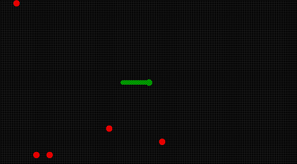

# Snake++
Jogo da cobrinha em C++ para Windows  
Utilizando a arcaica WinGDI (sem dependências)
# Imagens
  

# Linker Options
-lgdi32 -luser32 -lkernel32 -lcomctl32
# Download
[Snake++ Win32](https://github.com/guimoliveira/snake_plus_plus/raw/master/bin/Release/Snake%2B%2B.exe)
